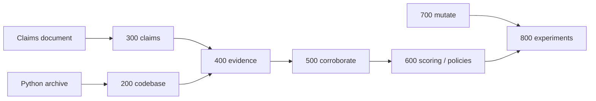
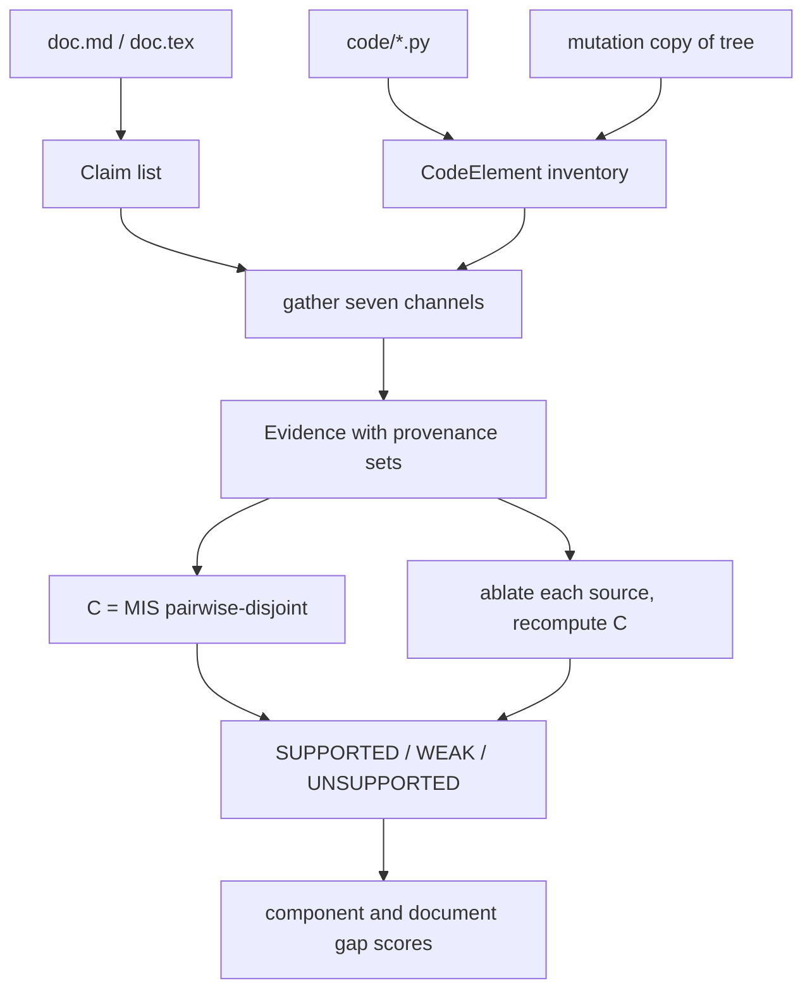
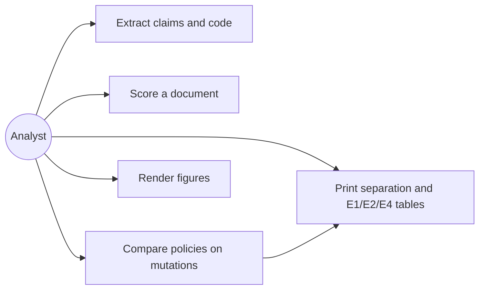
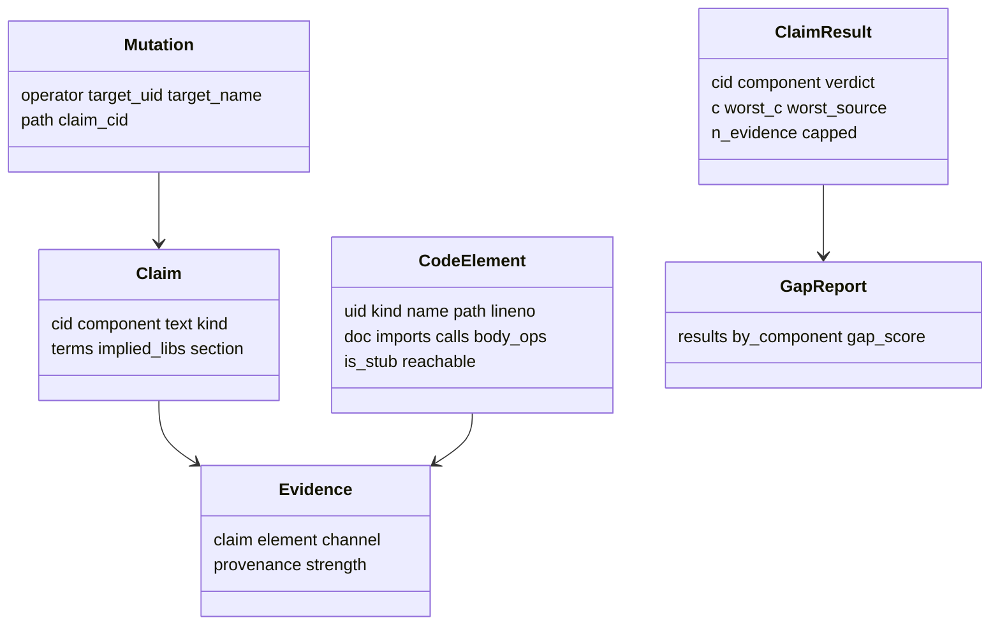
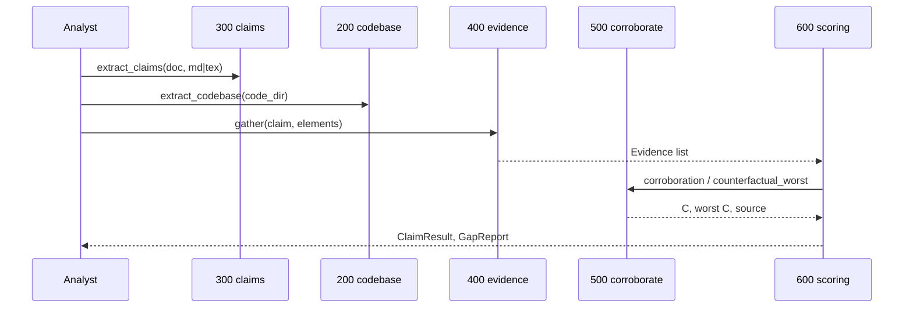

# Design

## System Architecture

Pipeline from documents and code to gap scores. Module numbers match the specification (100–800).

```
        claims document                       code archive
       (Markdown / LaTeX)                     (Python repo)
              |                                     |
      [300] claim extraction              [200] code extraction
      rule-based default                   AST inventory, call graph,
      (LLM backend deferred)               routes, schema, imports, tests
              |                                     |
              +------------------+------------------+
                                 |
                    [400] evidence generation
                    seven channels, provenance-tagged
                                 |
                    [500] corroboration engine
                    510 dependency classification
                    520 C(claim) = max disjoint set
                    530 counterfactual ablation
                                 |
                    [600] scoring and policies
                    per-claim verdict -> per-component
                    -> per-document gap score
                                 |
                    [800] experiments and figures
                         ^
                         |
                    [700] mutation corpus (labels by construction)
```



Set-valued provenance is load-bearing. If each piece of evidence carried a single channel tag, “channel-disjoint” would collapse into counting distinct channels and the maximum independent set would be decoration. Connected components are the wrong tool: `e1` may share a token with `e2` and `e2` share a file with `e3` while `e1` and `e3` remain disjoint.

## Data Flow



`strength` governs emission only. It plays no part in disjointness and no part in `C(claim)`. Making the count strength-weighted would reintroduce the rescaling the method argues cannot fix correlated agreement.

## Use Case



Primary actor: an analyst with a claims document and a Python tree. The system extracts artefacts, emits evidence, reports `C`, worst-case ablated `C`, and a verdict per claim, then a gap score. Experiments apply operators on a copy and score policies against labels known by construction. The system does not grade, detect plagiarism, or call a live LLM.

## Class Diagram



All of `Claim`, `CodeElement`, and `Evidence` are frozen. Provenance is `FrozenSet[str]`.

## Sequence Diagram



For evaluation, module 700 copies the tree, applies an operator, and records the targeted claim. Module 800 scores each policy on the gap class (not implemented) and writes `results/results.json`.

## Evaluation design

Scoring is at **(claim, element) granularity**: one evaluation pair per claim that had evidence on that element before the mutation. This is a correction. The original design labelled at claim level, marking a claim as a gap whenever its single lexical best-match element was mutated; measured on this corpus, 141 of 161 such claims remain genuinely implemented by other elements, so those labels were wrong and understated every evidence-based policy. The mis-specified table is retained in the README as a captioned diagnostic rather than deleted.

The **primary** comparison is `e2b_separation`: for each operator, the rate at which a policy accepts the pristine element against the rate at which it accepts the same element after mutation. Only that gap is skill — a policy that accepts nothing scores a flattering false-implemented rate while separating nothing. On `NOMINAL` (name and docstring kept, body gutted) `lexical`, `embedding` and `hybrid` separate by exactly 0.0 pp at every threshold in the sweep grid, while `cdc` separates by 100.0 pp.

Two properties of the harness constrain how its tables may be read, and both are design facts rather than incidental results:

- The 60/40 split behind the E1 table is **not group-aware**. The same `(project, cid, uid)` pair can appear on both sides of it across mutation rounds, so E1 is optimistic by an unmeasured amount and is not a held-out result. The separation table is not split-based and is the artifact to cite.
- `DELETE` removes the element from the tree, so on that operator no policy can accept anything and the gutted column is 0.0 for all seven policies by construction. Its pairs are free true positives and the row is a sanity check, not a discriminator. The DELETE n in the separation table (32, over all pairs) and the DELETE count inside the E1 test split (13, of 431 pairs) are different populations.

Two engine behaviours limit what the operators can measure. `cdc/mutate.py` weakens an algorithm by mapping `sha256` to `md5`, and `cdc/codebase.py` maps `md5` to `op:hash_weak` rather than dropping the operation, so `BODY` still fires after the weakening and `cdc` separates `WEAKEN` by 0.0 pp (n = 19) where `cdc_counterfactual` reaches 15.8 pp: a limitation of the operation vocabulary, not a bug. And `CALL` and `TEST` emit only when the callee is not a stub and another channel already fired, so a `NOMINAL` mutation can demote a claim; this is current `gather` behaviour, not the original spec table. The same gate is what makes counterfactual ablation expensive on thinly tested code: `cdc_counterfactual` accepts 79.59% of pristine `NOMINAL` pairs against `cdc`'s 100.00%, because `ledger schema:connect_memory` is called but no test calls it, so ablating `ch:CALL` collapses it. `cdc` is therefore the better default policy and `cdc_counterfactual` the stricter one.
